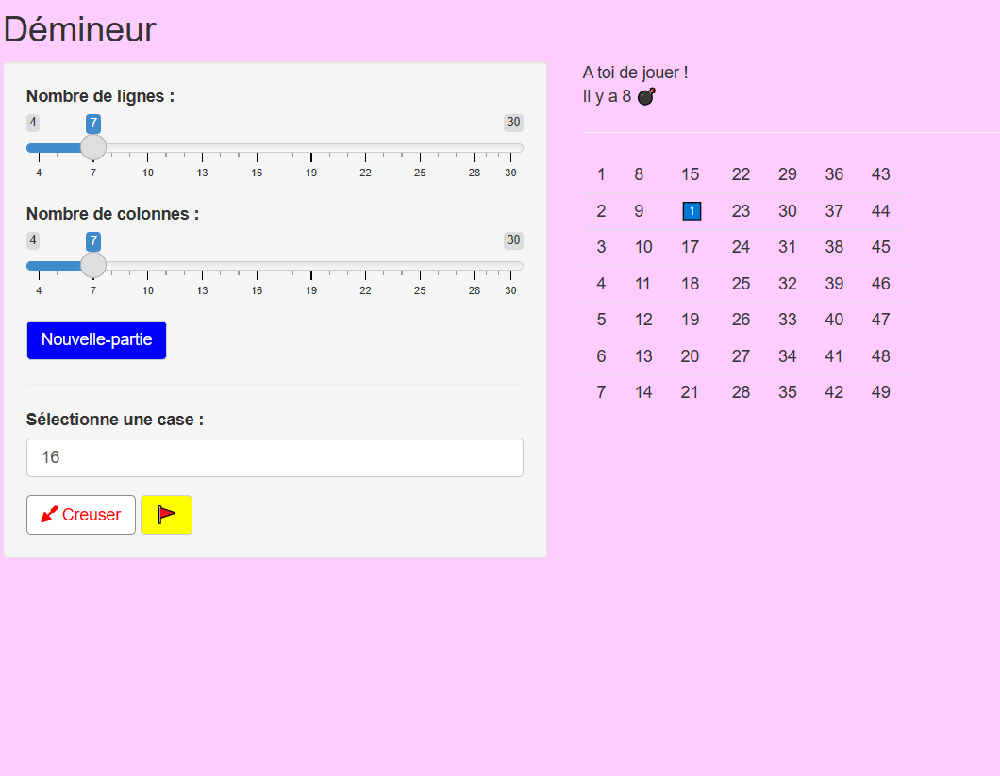

# Démineur :

Bibliothèque pour jouer au démineur.

# Objectif du projet :

L'objectif de notre projet est de créer une bibliothèque sur Rstudio, incluant une application shiny contenant des fonctions permettant tout d'abord à créer la grille du jeu et les cases à creuser puis les drapeaux et le nombre de bombes en affichant la victoire et l'echec.

# Application shiny :

Afin de pouvoir afficher l'application shiny il suffit d'installer le package `demineurER.tar.gz` et appeler la fonction `runapp()`.

# Membres du groupe:

Thamara Renoir  thamara.renoir@etu.umontpellier.fr

Maryem El Yamani  maryem.el-yamani@etu.umontpellier.fr
