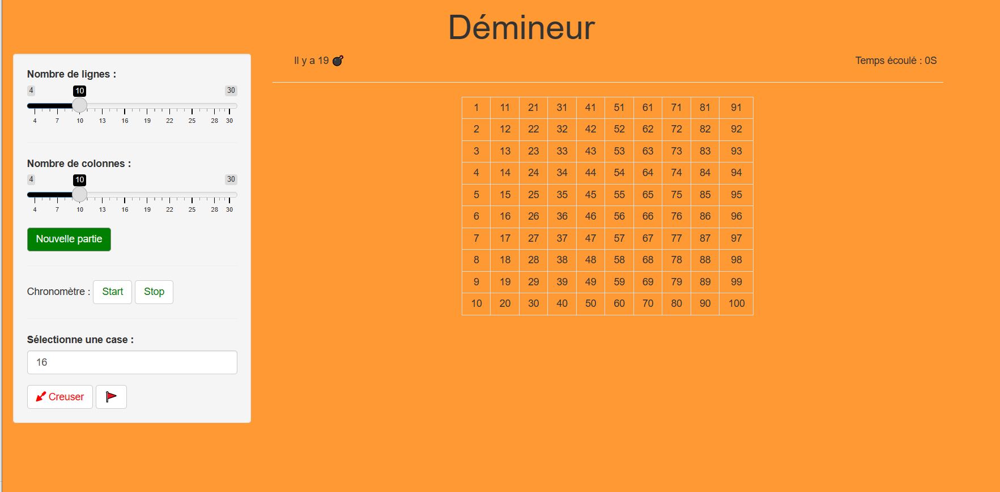
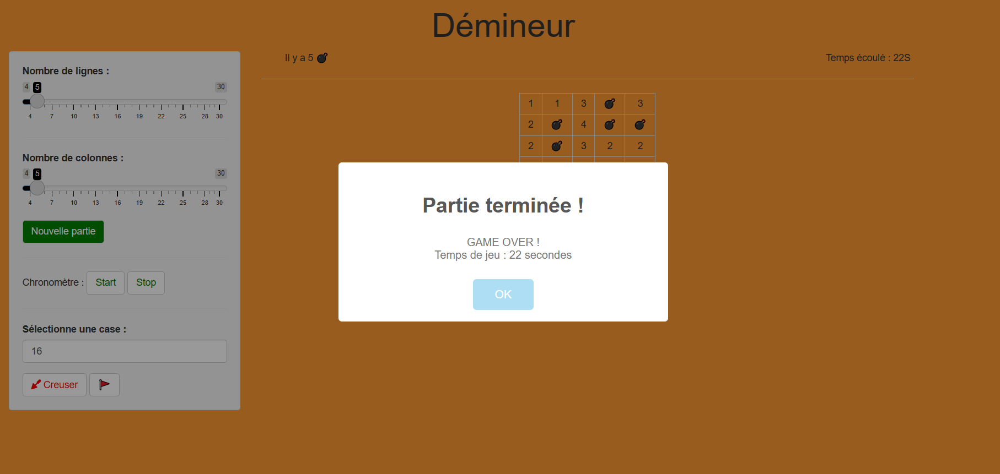
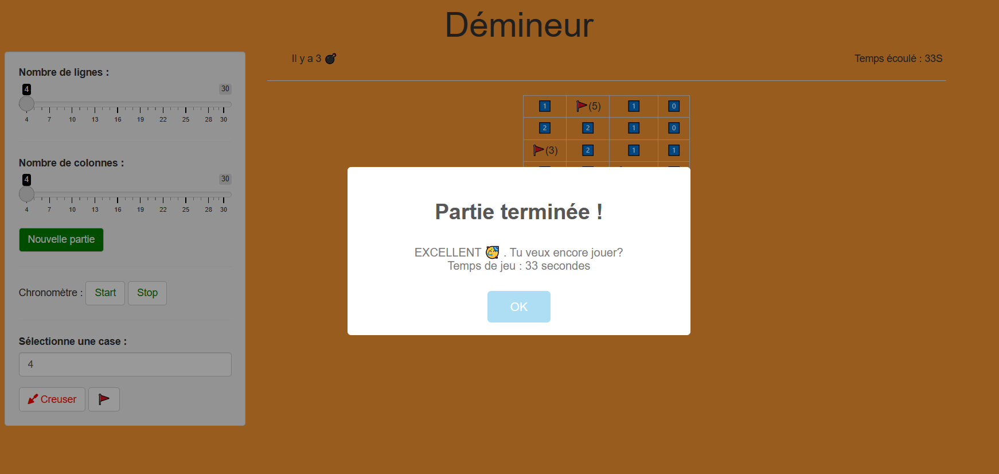

# Démineur :

Bibliothèque pour jouer au démineur.

# Objectif du projet :

L'objectif de notre projet est de créer une bibliothèque sur Rstudio, incluant une application shiny contenant des fonctions permettant de jouer au *Démineur* tel que:

- La fonction de la grille qu'on a créer à travers une matrice.
- La fonction creuser qui permet de creuser les cases numérotés.
- La fonction acreuser qui met en exergue les cases sans bombes.
- La fonction drapeau qui permet de mettre les drapeaux là où il y'a les bombes.
- La fonction gagne qui affiche la victoire ou l'echec.

# Application shiny :

- Pour creuser on choisit le nombre de cases dans le plateau . 

- Le jeu devient plus difficile quand on augmente le nombre de ligne et de colonnes qui sont modifiables, car les bombes varient selon la taille de la grille.

- 

- Si le joueur gagne on affiche "EXCELLENT"

 

- Si le joueur perd ça nous affiche "GAME OVER !"

Afin de pouvoir afficher l'application shiny il suffit d'installer le package `demineurER.tar.gz` et appeler la fonction `runapp()`.

# Membres du groupe:

Thamara Renoir  thamara.renoir@etu.umontpellier.fr

Maryem El Yamani  maryem.el-yamani@etu.umontpellier.fr
